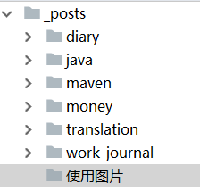

使用Hexo写博客也一段时间了，虽然写的博客不多，但一直避免使用图片，因为感觉在使用图片时，要考虑图片的存放路径和博客文档的路径。今天我决定彻底解决这个问题。

# 百度搜索Hexo 图片

搜索到很多前辈写的总结，比如使用Hexo相对路径、图床等方式。考虑到方便性和安全性，我决定将图片和博客文档放在同一个目录下，在博客文档中使用相对路径进行引用。

操作步骤：

1. 需要修改配置：将_config.xml中的post_asset_folder设置为true。
   ```
   post_asset_folder: true
   ```

3. 创建新博客，将新博客目录截图，保存为hexo-new.PNG
   ```
   hexo new 使用图片
   ```

   
   
   
   
4. 拷贝图片到博客目录中，这里将hexo-new.PNG拷贝到使用图片文件夹中。

5. 创建博客，并在博客文档中引用。-->在上面就用上了图片。

# 再插入一个美美的图片来结尾吧


